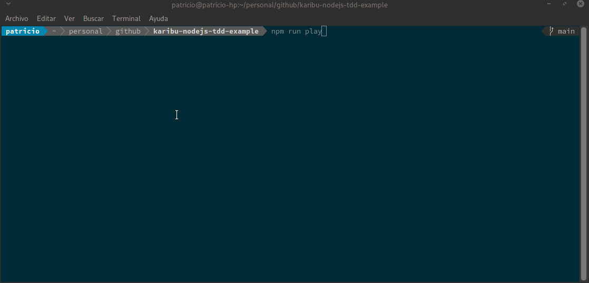

# Karibu Node.js TDD Example

Este proyecto tiene como educar en terminos básicos como utilizar el framework Jest e incluir algunas buenas prácticas en el camino.

Para esto se creo este viejo y conocido juego de adivinar el número a modo de instroducción de:

1. ¿Qué es Jest?
2. ¿Cómo comenzar con Jest?
3. Buenas Prácticas
4. Mocks y Spies con Jest

## El juego funcionando




## ¿Cómo partimos?

Este proyecto esta pensado para utilizar [NVM](https://github.com/nvm-sh/nvm), en el caso de que no te guste usarlo, es importante que sepas que esto fue desarrollado con la versión `16.9.1`.

Para los que usan NVM deben ejecutar el comando estandar para cambiar de versión:

```shell
nvm use
```

> Si tienen algún problema recuerden revisar la documentación de NVM

Luego se instalan las dependencias.

```shell
npm install
```

Por último a jugar:

```shell
npm run play
```

Este script ejecuta 2 scripts más:

| Script | Descripción                                                                     | Depdendencia |
| ------ | ------------------------------------------------------------------------------- | ------------ |
| test   | Ejecuta pruebas de Jest con algunos parámetros adicionales                      |              |
| lint   | Ejecuta reglas de eslint con Standard.js                                        |              |
| build  | Transpila código Typescript usando archivo de configuración tsconfig.build.json | test         |
| play   | Ejecuta el juego de adivinar el número                                          | test y build |


## Referencias

- [Configuración de Jest para Typescript](https://jestjs.io/docs/getting-started#using-typescript)
- [Función Global describe](https://jestjs.io/docs/api#describename-fn)
- [Función Global test](https://jestjs.io/docs/api#testname-fn-timeout)
- [Función Global expect](https://jestjs.io/docs/expect#expectvalue)
- [Función mockClear del objeto Mocks](https://jestjs.io/docs/mock-function-api#mockfnmockclear)
- [Función mockImplementation del objeto Mocks](https://jestjs.io/docs/mock-function-api#mockfnmockimplementationfn)
- [Función mock del objeto Jest](https://jestjs.io/docs/jest-object#jestmockmodulename-factory-options)
- [Función fn del objeto Jest](https://jestjs.io/docs/jest-object#jestfnimplementation)
- [Ejecución de pruebas lenta](https://jestjs.io/docs/troubleshooting#tests-are-extremely-slow-on-docker-andor-continuous-integration-ci-server)